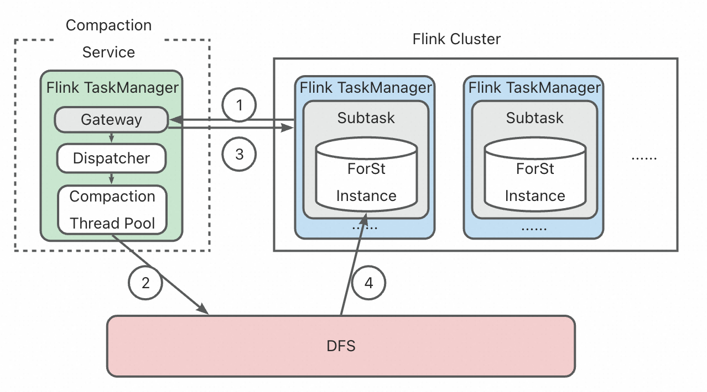

# Remote Compaction

This is a feature branch for remote compaction.
It will first introduce the design details of this feature.
Then it will guide you through a running example, where you can deploy a compaction service and run
a Flink job which offloads all its LSM-tree compaction works to the service.

## Introduction

### What It is and How It Works



Remote Compaction is a feature which enables the Flink job to offload all the LSM-tree compaction
works to a separate
service. This feature works with the disaggregated state management introduced by Flink 2.0.

Compaction Service is a standalone service which communicates with the Flink job through RPC.

The process is as follows:

1. Flink Task Manager sends compaction request to the Compaction Service, including information
   about
   the files to be compacted.
2. The Compaction Service accesses files on the DFS and executes the compaction works.
3. The Compaction Service sends information about the resulting files back to the Flink Task
   Manager.
4. Flink Task Manager accessed the resulting files on the DFS.

The compaction service is deployed within a Flink Task Manager. This allows the implementation to
reuse much of Flink's framework code, including resource management and DFS access.

Note that the Compaction Service can be placed in a separate Flink cluster from the Flink job, as
long as they can communicate with each other.

### How to Use

To config a Flink job to utilize remote compaction, you need to:

1. Start a Compaction Service. You start the compaction service to a Flink Cluster via Flink client.
   The process is the same as submitting a Flink job.
2. Get the IP address of the Task Manager that holds the Compaction service.
3. Start your Flink job. You need to config the `compactionServiceAddress` configuration to the IP
   address from Step-2.

For more details of the procedures, an end-to-end script can be found in
`remote-compaction-example/scripts/run_compaction_example.sh`.

### Limitations of the Current Implementation

Currently, the remote compaction service does not have a restart strategy. If the compaction service
fails, the Flink job requiring a compaction will:

1. Attempt to communicate with the Compaction Service before timing out.
2. Then fallback to a local compaction mode. That means it will execute the compaction works by
   itself from now on, instead of offloading to a Compaction Service.

Note that this is not a long-term issue, as the Compaction Service runs within a Flink Task Manager
and can leverage Flink’s high-availability (HA) mechanisms to quickly recover from failures.

Another limitation is that the Compaction Service uses a relatively simple scheduling strategy (
Round-Robin) to assign tasks to compactor threads.
Future work will include more sophisticated scheduling policies for dynamically allocating
compaction workers and assigning tasks.

## Running Example

This section will guide you through a running example.
You can follow the instructions to:

1. Build all the packages from source or download the pre-built images.
2. Deploy the compaction service and a Flink job cluster on Serverless Kubernetes.
3. Run a stateful Flink job, which utilizes ForSt StateBackend and offloads all the LSM-tree
   compaction works to the compaction service.

### Pre-requisites

To run this example, you need access to Serverless Kubernetes, which is available on most Cloud
Service Provider platforms.
Your Kubernetes cluster should have Java installed (Java 17 Recommended).

If you choose to build the packages from source, you also need to have the following tools
installed:

- Git
- Maven
- CMake
- G++

### Prepare the packages

#### [Option-1] Build the packages from source

1. Build ForSt

``` shell
git clone https://github.com/AlexYinHan/ForSt.git
cd ForSt
git checkout remote_compaction_feature
DEBUG_LEVEL=0  ROCKSDB_DISABLE_JEMALLOC=true DISABLE_WARNING_AS_ERROR=1 PORTABLE=1  CXXFLAGS="-Wno-error=shadow  -Wno-error-defaulted-function-deleted -Wno-unknown-warning-option -Wno-error-unused-private-field"  make -j`nproc` rocksdbjavastatic

# The Result Package:
#   ForSt-JNI Jar: java/target/forstjni-0.1.6-linux64.jar 
```

2. Build Flink

```shell
git clone https://github.com/AlexYinHan/flink.git
cd flink
git checkout remote_compaction_feature
mvn clean install -DskipTests -Dfast

# The Result Packages:
#  Flink Dist Directory: flink-dist/target/flink-2.1-SNAPSHOT-bin/flink-2.1-SNAPSHOT
#  ForSt StateBackend Jar: flink-state-backends/flink-statebackend-forst/target/flink-statebackend-forst-2.1-SNAPSHOT-jar-with-dependencies.jar
#  Compaction Service Jar: flink-examples/flink-examples-streaming/target/flink-examples-streaming-2.1-SNAPSHOT-CompactionService.jar
```

3. Prepare the Docker image

We recommend you use the Flink Official Image as your base image:

```shell
docker pull flink:2.0-java11
```

- Then, replace the /opt/flink with the Flink Dist Directory you built in the previous step.
- Next, copy the 'ForSt-JNI Jar' and 'ForSt StateBackend Jar' to the /opt/flink/lib directory.
- Finally, commit the Docker image.

#### [Option-2] Use the pre-built images

We have followed the same steps to build the Docker image as above.

You can access the Docker image:

```shell
docker pull alexyinhan/flink-community:fink-remote-compaciton
```

### Start the Flink Cluster

This section guides you to deploy the Flink clusters on Serverless Kubernetes.

In this example, the compaction service is placed in a separate Flink cluster from the Flink job. We
will refer to these two clusters as "Compaction Service" and "Flink Cluster", respectively.

If you are not familiar with Flink on Serverless Kubernetes, please refer to
the [documentation](https://nightlies.apache.org/flink/flink-docs-release-2.0/docs/deployment/resource-providers/standalone/kubernetes/).

We recommend you start a Kubernetes proxy first, to gain easy access to the Flink clusters:

```shell
kubectl proxy
```

The Kubernetes yaml files can be found in `remote-compaction-example` in this project.
Note that you should adjust the yaml files to your own setups. For example:

1. In the ```xxx-session.yaml``` files under ```services```, replace the Docker image with your own
   image.
2. Set the checkpoint directory to your DFS service.

```shell
cd remote-compaction-example

# Configuration and service definition
kubectl create -f configmaps/config_compactor.yaml
kubectl create -f configmaps/config_flink.yaml

# Create the deployments for Compactor and Flink cluster
kubectl create -f services/svc-compactor/jobmanager-service.yaml  
kubectl create -f services/svc-compactor/jobmanager-session.yaml 
kubectl create -f services/svc-compactor/taskmanager-session.yaml

kubectl create -f services/svc-flink/jobmanager-service.yaml 
kubectl create -f services/svc-flink/jobmanager-session.yaml 
kubectl create -f services/svc-flink/taskmanager-session.yaml       
```

If everything goes well, you have "Compaction Service" and "Flink Cluster" running.
You can check the status of the Flink clusters via Web UI though the Kubernetes proxy:

```shell
http://localhost:8001/api/v1/namespaces/default/services/flink-svc-compactor:webui/proxy/#/overview
http://localhost:8001/api/v1/namespaces/default/services/flink-svc-2-0:webui/proxy/#/overview
```

### Run a Flink Job with Remote Compaction

To run a stateful Flink job, you can prepare your own one.

Alternatively, we have also provided an example SQL job, which is the same one as in the paper but
with data
masking.
You can find it in `remote-compaction-example/src/ExampleJob/`.

An end-to-end script is provided in `remote-compaction-example/scripts/run_compaction_example.sh`.
It will start the compaction service and run the Flink job. The job is automatically configured to
use the compaction service.
All you need to do is specify the local path to your job Jar and Compaction Service Jar in the
script.

After the job starts, wait for a while and check the Task Manager logs, which indicates the
remote compaction is work:
> ... INFO ... org.apache.flink.state.forst.service.compaction.PrimaryDBClientJNI [] -
> invokeCompactionService ...

Or, in the log on the Compaction Service:
> ... INFO ... org.apache.flink.state.forst.service.compaction.CompactionServiceImpl [] - perform
> compaction on compaction-service side ...

You can also check the CPU metrics of your kubernetes cluster, to see the effect of compaction
service on both the Flink Cluster and the Compaction Service.
